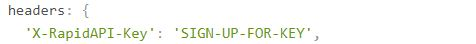

# QUICRICX
A chrome extension which displays the latest cricket news

## Installation
1. Clone the repository
2. Sign in/up on <a href="https://rapidapi.com" target="_blank">Rapid API</a> and go <a href="https://rapidapi.com/cricketapilive/api/cricbuzz-cricket" target="_blank">here</a>
3. You will see something like this

4. Your API key will appear here instead of <b>SIGN-UP-FOR-KEY</b>

5. Copy the API key and paste it instead of <b>SIGN-UP-FOR-KEY</b> in <b>script.js</b> file in <b>js</b> folder in the folder u cloned the repository
6. Now open chrome://extensions/ in your chrome browser
7. Enable developer mode
8. Click on load unpacked
9. Select the folder where you cloned the repository
10. Then pin the extension and click on it
11. You can now enjoy the latest cricket news on a single click